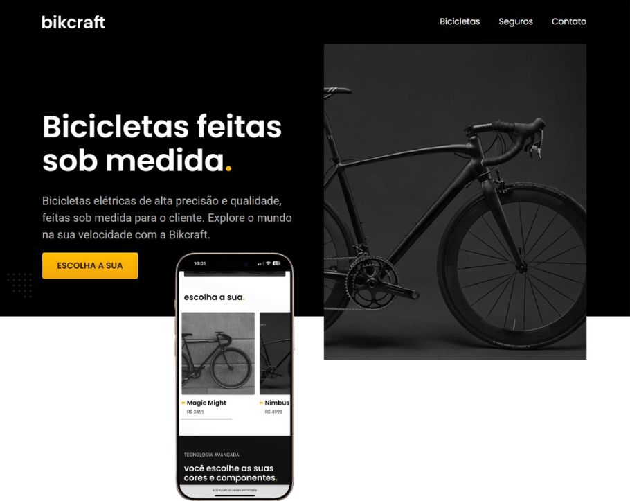

<h1 align="center">Bikcraft</h1>

  Bicycle store website, built to showcase different bike models and provide a smooth browsing experience for customers.  
  <a href="https://bikcraft-xi-seven.vercel.app/" target="_blank">Live Version →</a>

 

## About

This project was developed as part of the **Origamid course** focusing on front-end technologies like HTML, CSS, and JavaScript. 

## Features

- **Responsive Design**: The website is fully responsive and looks great on all devices.
- **Interactive Product Listings**: Users can browse through different bicycle categories and view details.
- **Smooth UI/UX**: Intuitive and visually appealing design, ensuring a fluid and enjoyable shopping experience.
  
## Technologies Used

- HTML
- CSS
- JavaScript
